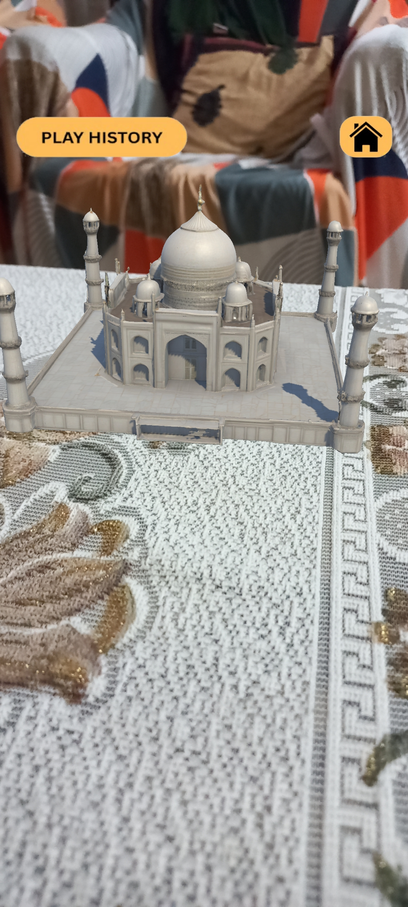
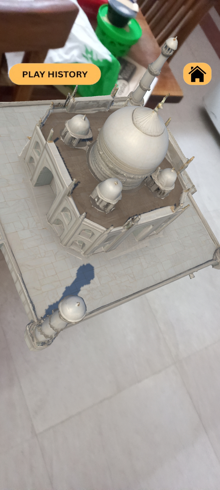
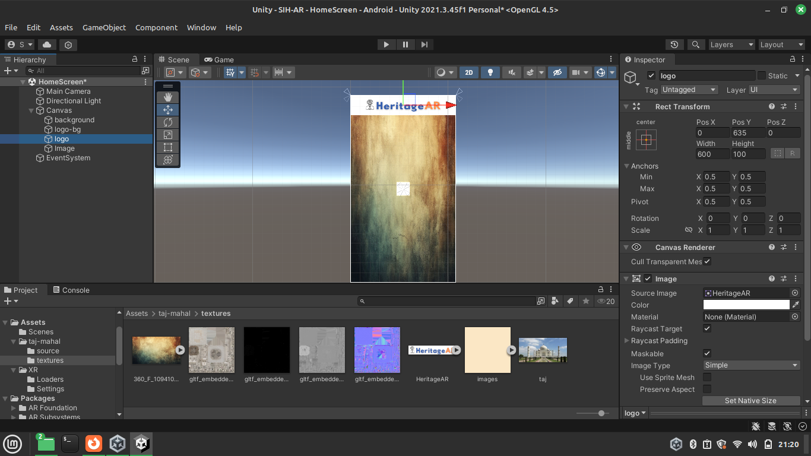
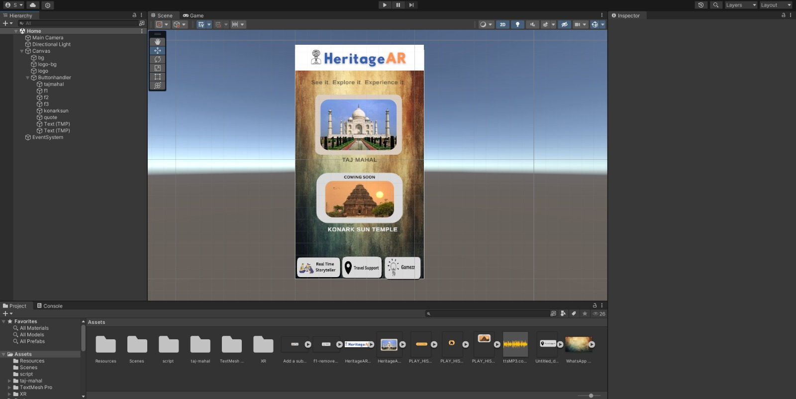
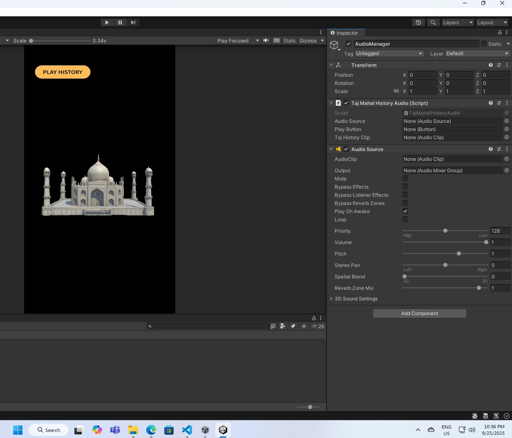
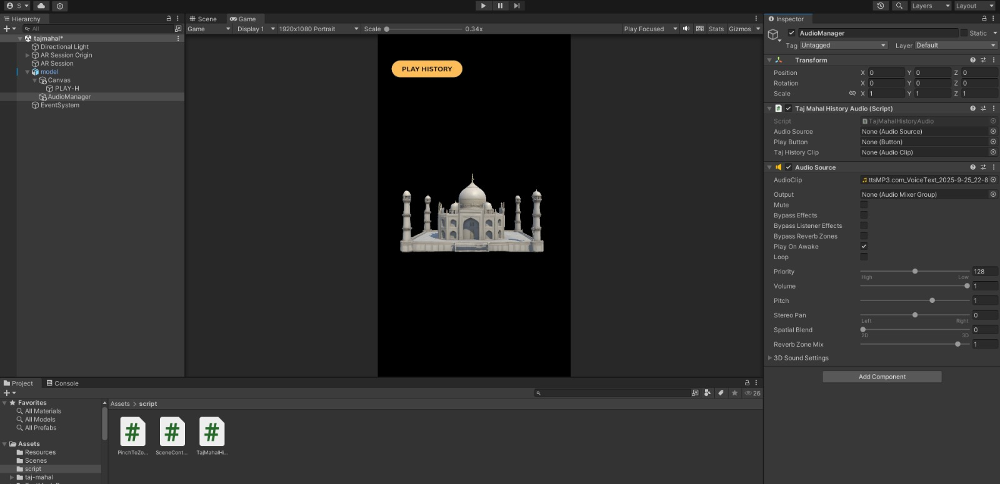

HeritageAR is an Augmented Reality (AR) application that brings historical monuments and cultural landmarks to life. Explore heritage sites in 3D, interact with them, and learn history in an immersive way.

## Installation
1. Download the APK: [HeritageAR APK](link-to-your-apk)
2. Install on Android device
3. Open the app and explore heritage sites in AR

## Prototype Preview
Below is the prototype of the HeritageAR app, showing the initial design and user interface.

HOME PAGE

AR VIEW OF TAJMAHAL

## Features
- AR-based 3D interactive heritage models
- Click & Learn history (Google Translate + AI/ML)
- Real-time location history teller (GPT-powered)
- Integrated travel & navigation services
- Gamification (quizzes & puzzles)
- Scalable platform globally

## Technologies Used
- Unity & C# for AR
FUTURE :
- Google Translate API
- GPT API for real-time history
- Firebase / Cloud backend

## MAKING OF HeritageAR

## Future Scope
- Adding more historical sites  
- Expand backend with nodejs 

## Team -
- Shivani - team lead
- Sheetal - member
- Shruti - member
- Shikha - member
- Khushbu - member